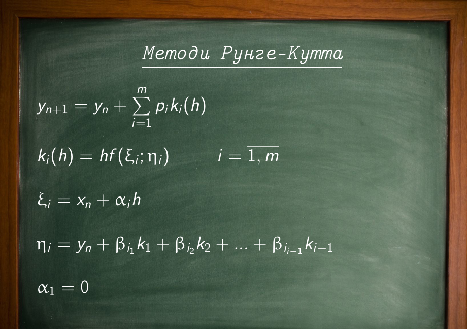
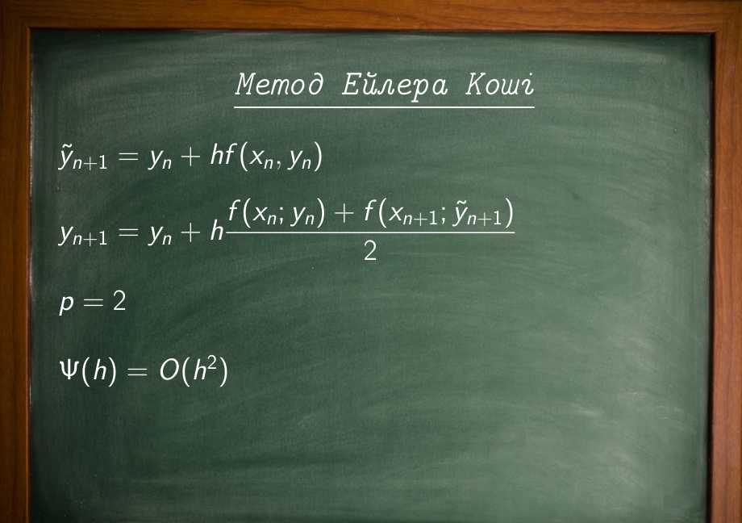
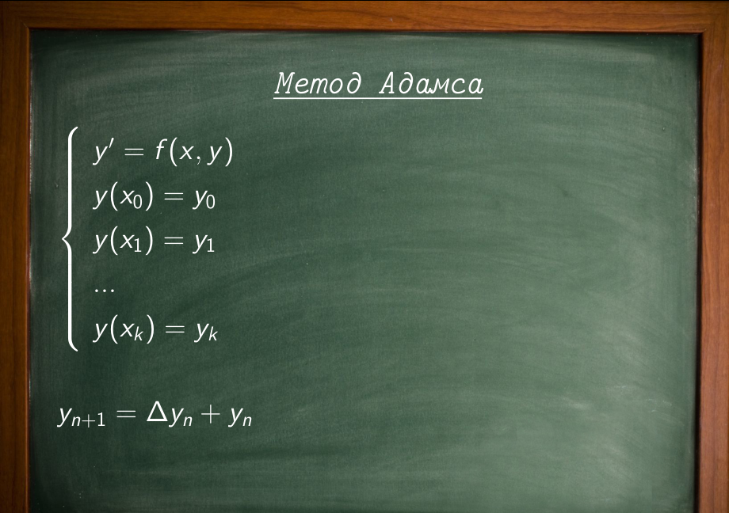
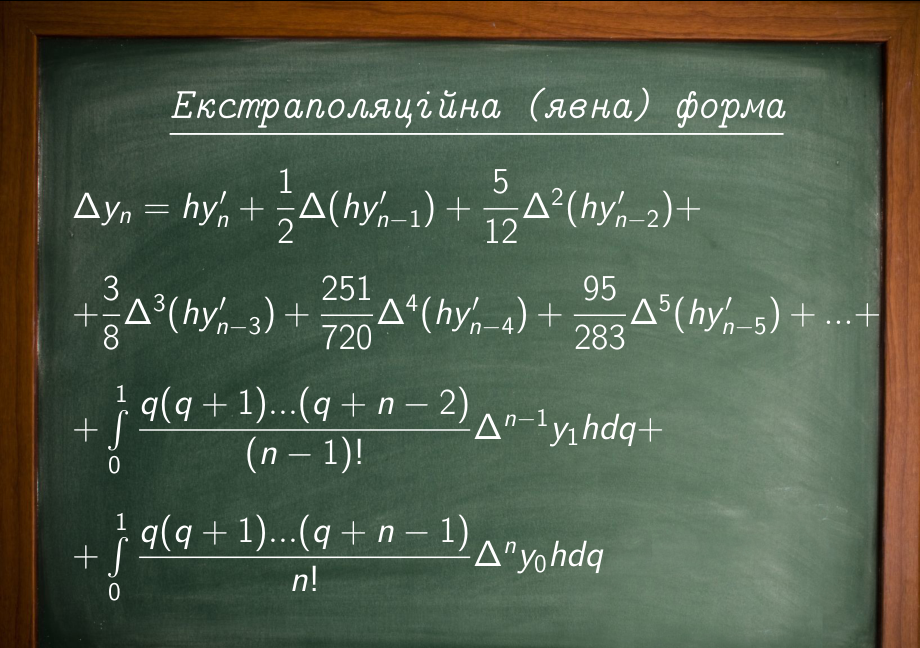

# Комп'ютерне моделювання <br> Лабораторна робота №2

###### Віннічук Назар <br> МІ-3

#### №1

> На вiдрiзку $x \in [1; 2]$ з кроком $h = 0.1$
> розв’язати рiвняння методом Рунге-Кутта III порядку
> точностi та методом Ейлера $(x^2+y)y′ = 1$;
> $y(1) = 1.1323$.

Виразимо $y'$ через $f(x, y)$.

$$ y' = f(x, y) = \frac{1}{x^2 + y} $$

Запишемо умову у термінах мови програмування.

```python
h = 0.1
xs = tuple(1 + i * h for i in range(11))
y_1 = 1.1323

def f(x, y):
    return 1 / (x*x + y)
```

##### Метод Ейлера


Знайдемо значення $y$ на заданому проміжку з відповідним кроком.

```python
ys = [y_1]

for x in xs[:-1]:
    ys.append(ys[-1] + h * f(x, ys[-1]))

print(ys)
```

Зобразимо графік знайденої функції.

```python
import matplotlib.pyplot as pyplot
import numpy

pyplot.plot(xs, ys)
pyplot.grid(True)
pyplot.show()
```

##### Метод Рунге-Кутта III порядку точності




Знайдемо значення $y$ на заданому проміжку з відповідним кроком.

```python
euler_ys = ys
ys = [y_1]

for x in xs[:-1]:
    y = ys[-1]
    k_1 = h * f(x, y)
    k_2 = h * f(x + h / 2, y + k_1 / 2)
    k_3 = h * f(x + h, y - k_1 + 2 * k_2)
    ys.append(y + (k_1 + 4 * k_2 + k_3) / 6)

print(ys)
```

Порівняємо графіки отримані методом Ейлера (синій) та методом Рунге-Кутта (жовтогарячий).

```python
pyplot.plot(xs, euler_ys)
pyplot.plot(xs, ys)
pyplot.grid(True)
pyplot.show()
```

#### №21

> На вiдрiзку $x \in [1; 2]$ з кроком $h = 0.1$
> розв’язати рiвняння явним чотирьохкроковим методом Адамса
> $(x^2+y)y′ = 1$; $y(1) = 1.1323$.
> Початковi значення y(x) знайти методом Ейлера-Коші.

##### Пошук початкових значень методом Ейлера-Коші



Знайдемо початкові значення $y$, кількість яких відповідає кількості кроків методу Адамса.

```python
runge_ys = ys
ys = [y_1]
steps = 4

for i in range(steps - 1):
    x = xs[i]
    y = ys[-1]
    y_tilde = y + h * f(x, y)
    ys.append(y + h / 2 * (f(x, y) + f(xs[i + 1], y_tilde)))

print(ys)
```

Порівняємо графіки отримані методом Ейлера (синій), методом Рунге-Кутта (жовтогарячий),
та методом Ейлера-Коші (зелений).

```python
pyplot.plot(xs, euler_ys)
pyplot.plot(xs, runge_ys)
pyplot.plot(xs[:steps], ys)
pyplot.grid(True)
pyplot.show()
```

##### Метод Адамса




Знайдемо значення $y$ на заданому проміжку з відповідним кроком використовуючи
початкові значення, знайдені методом Ейлера-Коші.

```python
y_primes = [f(x, y) for x, y in zip(xs[:steps], ys)]

def delta(delta_index, y_index):
    if delta_index == 1:
        return h * (ys[y_index + 1] - ys[y_index])
    return delta(delta_index - 1, y_index + 1) - delta(delta_index - 1, y_index)

for i in range(steps, len(xs)):
    delta_y = h * (
        y_primes[-1] +
        1 / 2 * delta(1, -2) +
        5 / 12 * delta(2, -3) +
        3 / 8 * delta(3, -4)
    )
    ys.append(delta_y + ys[-1])
    if i + 1 < len(xs):
        y_primes.append(f(xs[i + 1], ys[-1]))

print(ys)
```

Порівняємо графіки отримані методом Ейлера (синій), методом Рунге-Кутта (жовтогарячий),
та методом Адамса (зелений).

```python
pyplot.plot(xs, euler_ys)
pyplot.plot(xs, runge_ys)
pyplot.plot(xs, ys)
pyplot.grid(True)
pyplot.show()
```

<style>
    body {
        font-family: sans-serif;
    }
    .MathJax * {
        color: inherit !important;
    }
</style>
